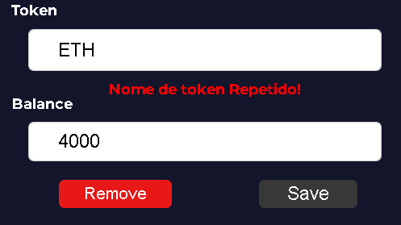
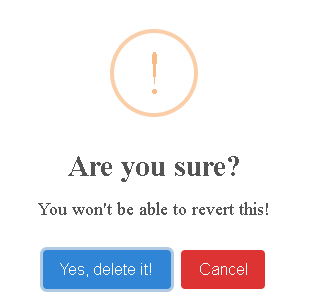

# Boas-vindas ao repositório do projeto Klever Wallet!

Este projeto tem como objetivo atender aos requisitos do [Klever - Junior Frontend Test](https://github.com/klever-io/frontend-junior-test)

Tecnologias usadas no projeto:

-HTML/CSS/JAVASCRIPT
-React
-React Router
-SweetAlert2

 <strong>Home</strong>
 

  

- [x] When clicking on the "Add Token" button go to the "Add Token" page
- [x] When click on the icon "Edit" go to the "Edit Token" page

  <strong>Add Token</strong>
 

  - [x] The Token field is required
  - [x] The Balance field is required
  - [x] When clicking on the "Back" button go to the "Home" page

  >When clicking on the icon "Save" button
  - [x] Save the data in localStorage from Browser
  - [x] Navigate user to home page

  
  
  - [x] The Token name should be unique, the user shouldn't has token names repeated
  - [x] Display the error messages from the form to the user

 <strong>Edit Token</strong>
 

 

 - [x] When clicking on the "Back" button go to the "Home" page
When clicking on the "Save" button
- [x] Save the data in localStorage
- [x] Navigate user to home page
 When clicking on the "Remove" button
- [x] Remove the date from local storage
- [x] Navigate user to home page

- [x] When the user clicks on the "Remove" button should display an alert to the user to confirm the remotion.
- [x] If confirmed, the token should be deleted
- [x] If denied, the alert closes and the token not should be deleted,

  
